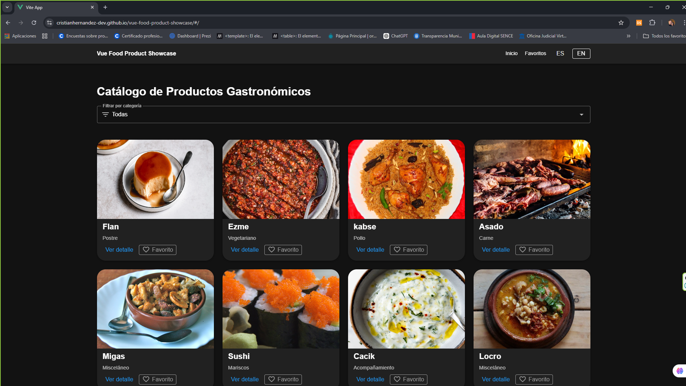
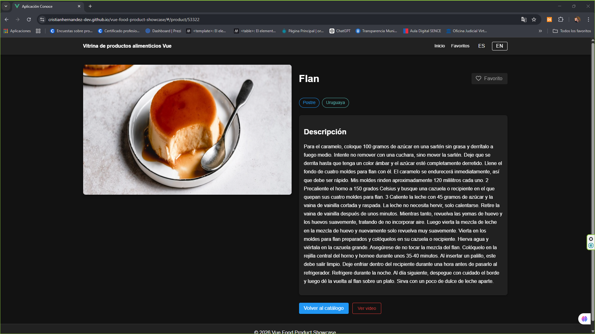
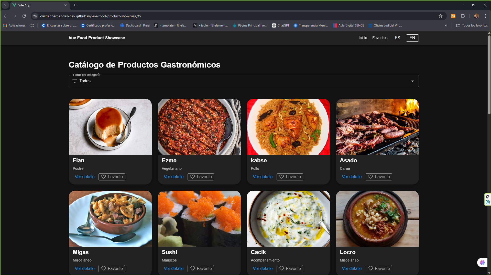
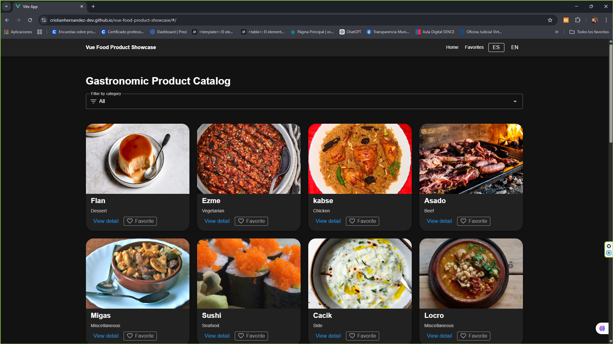
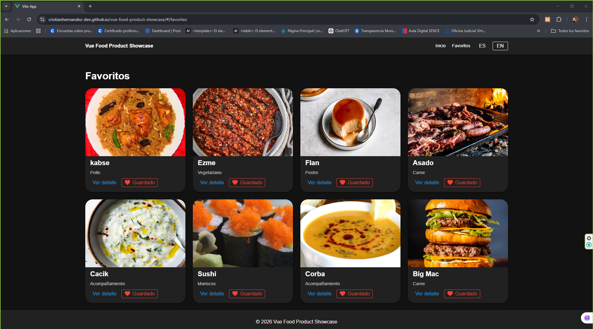

🍽️ Vue Food Product Showcase


Aplicación SPA desarrollada con Vue 3 que funciona como un catálogo interactivo de productos gastronómicos. La app consume datos desde una API REST pública, permite filtrar por categorías, visualizar detalles individuales, gestionar favoritos y cambiar entre idiomas español e inglés.

---
🌐 Demo en vivo

👉 https://cristianhernandez-dev.github.io/vue-food-product-showcase/#/

---

## 📸 Vista previa

### Vista principal


### Vista detalle


### Cambio de idioma




### Favoritos


---

## Descripción del proyecto

Este proyecto fue desarrollado como una propuesta de catálogo interactivo de productos, aplicando una arquitectura moderna basada en componentes reutilizables, gestión centralizada del estado con Vuex, navegación por rutas, consumo de API con Axios y diseño visual con Vuetify.

La temática fue adaptada a productos gastronómicos utilizando TheMealDB como fuente de datos, lo que permitió implementar un catálogo dinámico, visual y escalable.

---

## Objetivos cumplidos

- Visualización de productos obtenidos desde una API REST.
- Uso de componentes reutilizables y organización modular.
- Gestión del estado global mediante Vuex.
- Filtro por categorías.
- Vista de detalle individual.
- Gestión de favoritos persistidos en `localStorage`.
- Interfaz responsive con Vuetify.
- Soporte multilenguaje básico con `vue-i18n`.
- Manejo de estados de carga, error y sin resultados.

---

## Tecnologías utilizadas

- Vue 3  
- Vue Router  
- Vuex 4  
- Axios  
- Vuetify (UI Framework)  
- Vue I18n  
- Vite  

---

## API utilizada

La aplicación consume datos desde la API pública de TheMealDB:

- Listado general de productos: `/search.php?s=`  
- Listado de categorías: `/list.php?c=list`  
- Detalle por ID: `/lookup.php?i={id}`  

---

## Características principales

### Catálogo interactivo
Muestra una grilla de productos gastronómicos con imagen, nombre y categoría.

### Filtro por categoría
Permite al usuario filtrar los productos según la categoría seleccionada.

### Vista de detalle
Cada producto cuenta con una vista detallada con imagen ampliada, categoría, origen y descripción.

### Favoritos
Los usuarios pueden agregar o quitar productos de favoritos. Esta información se guarda en `localStorage`.

### Internacionalización
La interfaz permite cambiar entre español e inglés. Se traducen:
- navegación  
- botones  
- títulos  
- categorías  
- origen del producto  

La descripción larga proveniente de la API se mantiene en su idioma original.

---

## 🧱 Arquitectura del proyecto

El proyecto está estructurado bajo una arquitectura modular basada en componentes:
```bash
src/
├── components/       # Componentes reutilizables (UI)
├── views/            # Vistas principales (Home, Detail, Favorites)
├── router/           # Definición de rutas (SPA)
├── store/            # Estado global con Vuex
├── services/         # Consumo de API externa
├── i18n.js           # Configuración de idiomas
└── main.js           # Inicialización de la app
```
## 🧠 Enfoque aplicado

- **Separación clara de responsabilidades (UI / lógica / datos)**
- **Componentes reutilizables y desacoplados**
- **Estado centralizado con Vuex**
- **Navegación controlada con Vue Router**


## 📦 Instalación y ejecución

### 1. Clonar el repositorio

```bash
git clone https://github.com/cristianhernandez-dev/vue-food-product-showcase.git
```


### 2. Entrar al proyecto
```bash
cd vue-food-product-showcase
```
### 3. Instalar dependencias
```bash
npm install
```
### 4. Ejecutar en entorno local
```bash
npm run dev
```

**Luego abre la URL que entrega Vite en la terminal, normalmente:**

```bash
http://localhost:5173
```
## 🏗️ Build para producción
```bash
npm run build
```
## 🚀 Deploy en GitHub Pages
```bash
npm run build
git add -f dist
git commit -m "Deploy"
git subtree push --prefix dist origin gh-pages
```


## 🧠 Decisiones técnicas relevantes

- **Se utilizó createWebHashHistory() para evitar problemas de rutas en GitHub Pages.**
- **Se implementó diseño mobile-first con enfoque responsive.**

### Uso de Vuex

Se utilizó Vuex para centralizar el estado de productos, filtros y favoritos, permitiendo una arquitectura más ordenada y escalable.

### Uso de Vuetify

Se eligió Vuetify para construir una interfaz moderna, responsive y consistente, utilizando componentes como tarjetas, botones, selectores, alertas y grilla responsive.

### Uso de Vue Router

Se implementó Vue Router para manejar la navegación entre:

- vista principal  
- detalle de producto  
- favoritos  

### Uso de TheMealDB

Se optó por esta API por su estabilidad, facilidad de integración y estructura adecuada para representar un catálogo visual de productos gastronómicos.

### Internacionalización

Se incorporó vue-i18n para soportar múltiples idiomas, mejorar la experiencia de usuario y demostrar una mejora funcional y profesional en la interfaz.

---
### 📚 Aprendizajes clave
Durante el desarrollo se consolidaron conocimientos en:

- Arquitectura SPA con Vue
- Manejo de estado global
- Internacionalización de aplicaciones
- Resolución de errores en producción (deploy y rutas)
- Diseño responsive moderno
---
### Estado del proyecto

- ✅ Proyecto finalizado
- 🚀 Desplegado en producción
- 📱 Optimizado para dispositivos móviles
---
### 📌 Conclusión

Vue Food Product Showcase es una SPA que demuestra el uso de Vue en un escenario realista de catálogo interactivo, integrando consumo de API, gestión de estado global, componentes reutilizables, diseño responsive e internacionalización básica.
---

## 👨‍💻 Autor
- Cristián Hernández
- Frontend Developer en formación 🚀
- GitHub: https://github.com/cristianhernandez-dev
---